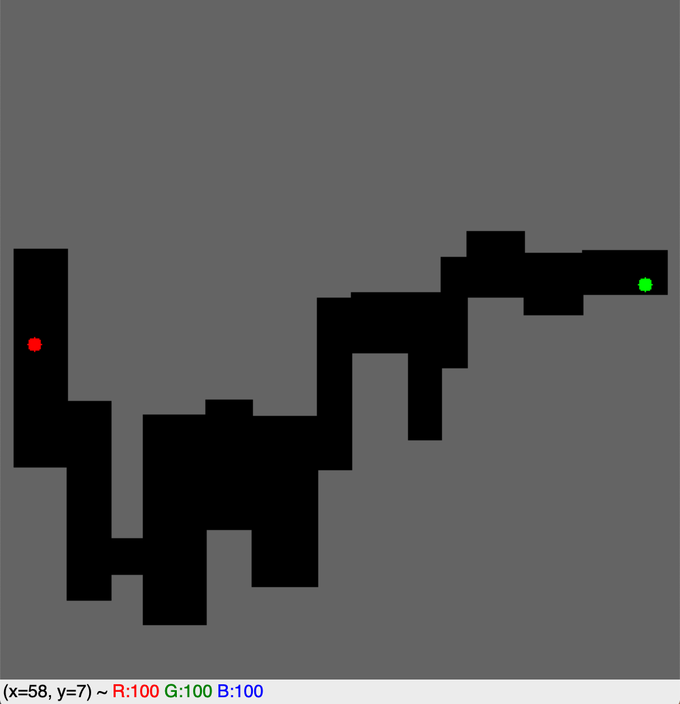

# DQN_RL_maze-

This repository contains the 2nd Reinforcement Learning coursework from the Department of Computing, Imperial College London, Academic Year 2019-2020, delivered by Dr A. Aldo Faisal and Dr Edward Johns. The coureseworks were developed with their PhD students.  

This project consists of building an DQN implementation to solve a maze problem.  
The random_environment.py and train_and_test.py files were given.  
The random_environment.py file creates random maze environments.  
The train_and_test.py creates an environment, trains the agent 10 minutes, and then tests it.

Important features of the DQN implementation in the agent.py file comparted of:  
- Epsilon-greedy policy (lines 95-99)
- Epsilon decay with steps before being clipped at 0.005 (lines 111-117)
- Experience replay buffer (lines 279-334)
- Prioritised experience replay (lines 313-318)
- Decaying episode length with number of steps (lines 69-78)
- Reward function which penalises hitting the wall proportionally to the distance from the goal, gives 0 reward for moving vertically and rewards positively when entering a circle close to the reward state (lines 142-156)

A **simple** maze example:

